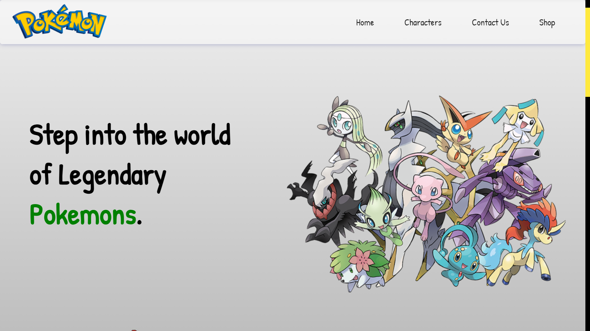
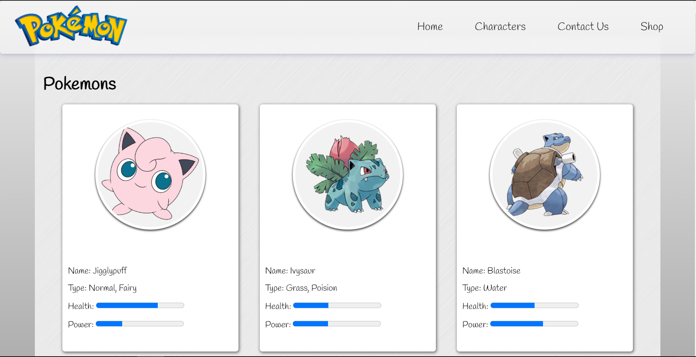

# Fandom Website (Pokemon)
## Click on the link below to access the fandom website
### [Click here](https://sagar-sharma-7.github.io/Fandom-website/)
----------


## Here are some screen shots
<p align="center">
  
  
</p>

----------


## Editor used 


## Built with 
 
 
 
 
 
 
----------


 ## Cloning this repositary using command line
 1. Open **Git Bash**.
 1. Change the current working directory to the location where you want the cloned directory.
 1. Type `git clone https://github.com/Sagar-Sharma-7/Fandom-website.git`
 1. Press **Enter** to create the clone of this repositary.
----------


 ## Font used 
```css 
@import url("https://fonts.googleapis.com/css2?family=Handlee&display=swap");

* {
  font-family: "Handlee", cursive;
}
```
----------


## License 
### The scripts and documentation in this project are released under the MIT License 


-----
-----

# Web Designing Competition.
## Made by [Pranjal](https://github.com/Pranjal60) and [Sagar](https://github.com/Sagar-Sharma-7)

-----

 <p float="left">

[](https://github.com/Sagar-Sharma-7)
[ ](https://github.com/Sagar-Sharma-7)

</p>
